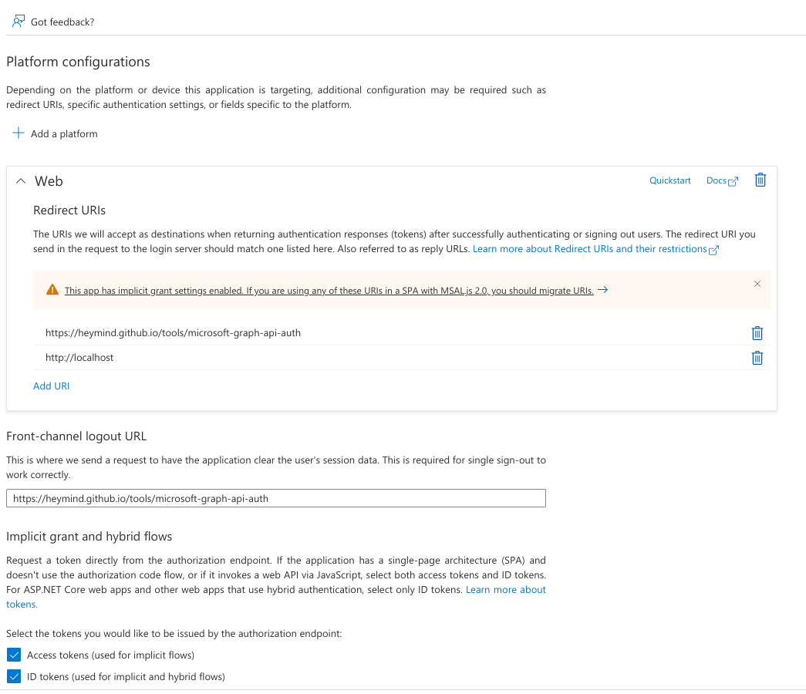

<div align="center">
  <image src="assets/onedrive-cf-index.png" alt="onedrive-cf-index" width="150px" />
  <h3><a href="https://storage.spencerwoo.com">onedrive-cf-index</a></h3>
  <em>Yet another OneDrive index, powered by CloudFlare Workers.</em>
</div>

---

# Pellaeon's custom version

This version is derived from https://github.com/spencerwooo/onedrive-cf-index .

Additional features:

- `defaultRawFile` mode
- Can show file inline in browser instead of always prompting for download

## Deployment note

### wrangler [obsolete, wrangler now has 2.x]

Do not use `npm` to install `wrangler`, it didn't work for me.

If you don't often need to use wrangler, installing with `cargo` is also too bloated, just download the executable from https://github.com/cloudflare/wrangler/releases

### Deploy

Note:
- If you encounter `Your secret is too large, it must be 1kB or less.` in `wrangler`, see https://github.com/spencerwooo/onedrive-cf-index/issues/58#issuecomment-733419639
- When obtaining tokens, if Microsoft warns you that you should use type "Single Page Application", don't use it, it's caused by the problem mentioned in step 3.
- When obtaining tokens, if Microsoft warns you that you need to use "Proof Key for Code Exchange", you have registered an application of type "Single Page Application". Remove all URLs of that type from your Azure settings.

### The refresh token has expired (or "Worker threw exception Error 1101")

#### Check
If you don't use the worker for more than 90 days, its refresh_token will expire. If you are not sure if your refresh token has expired, go to *Quick Edit* in the Worker admin page. Then *Send* a request to the worker using the dev console, on the *Console* tab below it will show this error from Onedrive API:

```
getAccessToken error "{\"error\":\"invalid_grant\",\"error_description\":\"AADSTS700082: The refresh token has expired due to inactivity. The token was issued on 2022-03-02T03:54:33.8043551Z and was inactive for 90.00:00:00.
```

#### Solve

Follow **step 6 and 7** of the *Generating OneDrive API Tokens* section below. And update the REFRESH_TOKEN using `wrangler secret put`.

---

[](https://storage.spencerwoo.com/)
[](https://github.com/spencerwooo/onedrive-cf-index/actions?query=workflow%3ADeploy)
[](./README-CN.md)

<h5>This project uses CloudFlare Workers to host and share your personal OneDrive files. It is greatly inspired by: <a href="https://github.com/heymind/OneDrive-Index-Cloudflare-Worker">onedrive-index-cloudflare-worker</a>.</h5>

## Demo

Live demo at [Spencer's OneDrive Index](https://storage.spencerwoo.com/).


## Features

### 🚀 General

- Breadcrumbs for better navigations.
- Tokens cached and automatically refreshed with Cloudflare Workers KV storage.
- Route lazy loading with the help of [Turbolinks®](https://github.com/turbolinks/turbolinks).
- Supports OneDrive 21Vianet.（由世纪互联运营的 OneDrive。）
- Supports mounting SharePoint.

### 🗃️ Folder indexing

- Complete new and customisable design at [spencer.css](themes/spencer.css).
- Emoji as folder icon when available (if the first character of the folder name is an emoji).
- Renders `README.md` if found in current folder. Rendered with [github-markdown-css](https://github.com/sindresorhus/github-markdown-css).
- Supports pagination, no more limitations like 200 items max for each folder ever again!

### 📁 File previews

- File icon rendered according to file type, [Font Awesome icons](https://fontawesome.com/) for cleaner look.
- Plain text: `.txt`. [_DEMO_](https://storage.spencerwoo.com/%F0%9F%A5%9F%20Some%20test%20files/Previews/iso_8859-1.txt).
- Markdown: `.md`, `.mdown`, `.markdown`. [_DEMO_](https://storage.spencerwoo.com/%F0%9F%A5%9F%20Some%20test%20files/Previews/i_m_a_md.md).
- Image, supports Medium style zoom effect: `.png`, `.jpg`, and `.gif`. [_DEMO_](https://storage.spencerwoo.com/%F0%9F%A5%9F%20Some%20test%20files/Previews/).
- Code with syntax highlighting: `.js`, `.py`, `.c`, `.json`.... [_DEMO_](https://storage.spencerwoo.com/%F0%9F%A5%9F%20Some%20test%20files/Code/pathUtil.js).
- PDF: Lazy loading, loading progress and built-in PDF viewer. [_DEMO_](<https://storage.spencerwoo.com/%F0%9F%A5%91%20Course%20PPT%20for%20CS%20(BIT)/2018%20-%20%E5%A4%A7%E4%BA%8C%E4%B8%8B%20-%20%E8%AE%A1%E7%AE%97%E6%9C%BA%E5%9B%BE%E5%BD%A2%E5%AD%A6/1%20FoundationofCG-Anonymous.pdf>).
- Music / Audio: `.mp3`, `.aac`, `.wav`, `.oga`. [_DEMO_](https://storage.spencerwoo.com/%F0%9F%A5%9F%20Some%20test%20files/Multimedia/Elysian%20Fields%20-%20Climbing%20My%20Dark%20Hair.mp3).
- Videos: `.mp4`, `.flv`, `.webm`, `.m3u8`. [_DEMO_](https://storage.spencerwoo.com/%F0%9F%A5%9F%20Some%20test%20files/Multimedia/%E8%BD%A6%E5%BA%93%E5%A5%B3%E7%8E%8B%20%E9%AB%98%E8%B7%9F%E8%B9%A6%E8%BF%AA%20%E4%B9%98%E9%A3%8E%E7%A0%B4%E6%B5%AA%E7%9A%84%E5%A7%90%E5%A7%90%E4%B8%BB%E9%A2%98%E6%9B%B2%E3%80%90%E9%86%8B%E9%86%8B%E3%80%91.mp4).

### ⬇️ Proxied / raw file download

- [Optional] Proxied download: `?proxied` - Downloads the file through CloudFlare Workers if (1) `proxyDownload` is true in `config/default.js` and (2) parameter is present in url.
- [Optional] Raw file download: `?raw` - Return direct raw file instead of rich rendered preview if parameter is present.
- Both these parameters can be used side by side, meaning that `?proxied&raw` and `?raw&proxied` are both valid.

Yes, this means you can use this project as an image storage service or for serving static files, for example:

```
https://storage.spencerwoo.com/%F0%9F%A5%9F%20Some%20test%20files/nyancat.gif?raw
```


### 🔒 Private folders


You can limit access to folders (i.e., declaring private folders) by adding their paths to `ENABLE_PATHS` inside `src/auth/config.js`. You can optionally enable this feature with the `AUTH_ENABLED` toggle variable also inside that file, and you can specify the username in `NAME` and the password using wrangler.

Note that the password is stored inside the `AUTH_PASSWORD` Cloudflare Worker secret. You should never commit your password into a git repository, not even a private one. The `AUTH_PASSWORD` secret can be added with wrangler:

```bash
wrangler secret put AUTH_PASSWORD
# Type out your self-defined AUTH_PASSWORD here
```

Check out [the following sections](#preparations) for details on using wrangler to set CloudFlare Worker secrets (which are also called environment variables).

### Others

See the new features section at the original [onedrive-index-cloudflare-worker](https://github.com/heymind/OneDrive-Index-Cloudflare-Worker#-%E6%96%B0%E7%89%B9%E6%80%A7-v11) project page for reference, **although I cannot guarantee that all features are usable.**

## Deployment

_Very, very long, tedious, step by step guide warning!_

### Generating OneDrive API Tokens

1. Log in to your Azure domain admin account. Create a new blade app here [Microsoft Azure App registrations](https://portal.azure.com/#blade/Microsoft_AAD_RegisteredApps/ApplicationsListBlade) (OneDrive normal version) or [Microsoft Azure.cn App registrations](https://portal.azure.cn/#blade/Microsoft_AAD_RegisteredApps/ApplicationsListBlade) (OneDrive 世纪互联版本):

   1. Login with your Microsoft account, select `New registration`.
   2. Input `Name` for your blade app, `my-onedrive-cf-index` for example.
   3. Set `Supported account types` to `Accounts in any organizational directory (Any Azure AD directory - Multitenant) and personal Microsoft accounts (e.g. Skype, Xbox)`. OneDrive 世纪互联用户设置为：`任何组织目录（任何 Azure AD 目录 - 多租户）中的帐户`.
   4. Set `Redirect URI (optional)` to `Web` (the multiselect dropdown) and `http://localhost` (the URL).
   5. Click `Register`.

   

Note: seems like there might be problems if the application is not created by a Azure domain admin account. The application created by domain admins can be used by others in the domain.

2. Get your Application (client) ID - `client_id` at `Overview` panel.

   

3. Open `Certificates & secrets` panel, click `New client secret` and create a new secret called `client_secret`, set `Expires` to , click `Add`, and copy the `Value` of the `client_secret` (**You only have this one chance to copy it.**).

   

4. Open `API permissions` panel, select `Microsoft Graph`, select `Delegated permissions`, search for `offline_access, Files.Read, Files.Read.All`, **select all three of them** and click `Add permissions`.

   

   You should have these permissions ready:

   

5. Open `Authentication` panel, click `Add a platform`, select `Web`, fill in the following redirect URL:

   ```
   https://heymind.github.io/tools/microsoft-graph-api-auth
   ```

   Under `Front-channel logout URL`, fill in the same URL. (Though it shouldn't matter what you fill in as long as it's a URL.)

   Under `Implicit grant and hybrid flows`, check both options (Access tokens and ID tokens).

   

6. Go to the [MGAA tool](https://heymind.github.io/tools/microsoft-graph-api-auth), under `4. Authorize for code`, fill in your client ID. Make sure `Scope` is `offline_access Files.Read Files.Read.All`.

Click `Authorize`. You will be redirected to Microsoft login page. Login and grant permission to the application.

You will be redirected back to MGAA, a prompt will show your "code", copy the code.

Note: if the folder you want to share is owned by an account different from the account you used to create the blade app, you should open the MGAA tool in a different browser (logged in to the folder owner account).

7. Edit `refresh_token.sh`, fill in client ID, client secret and "code" from previous step. Then execute the script. It will return something like this:

   ```
   {"token_type":"Bearer","scope":"Files.Read Files.Read.All profile openid email","expires_in":5092,"ext_expires_in":5092,"access_token":"eyJ0eXAiO9....",
   "refresh_token":"0.AXEAR02q_...."}
   ```

   You now have your refresh_token in quotes `0.AXEAR02q_...`.

6. Finally, create a dedicated folder for your public files inside OneDrive, for instance: `/Public`. Please don't share your root folder directly!

After all this hassle, you should have successfully acquired the following tokens and secrets:

- `refresh_token`
- `client_id`
- `client_secret`
- `redirect_uri`
- `base`: Defaults to `/Public`.

_Yes, I know it's a long and tedious procedure, but it's Microsoft, we can understand. 🤷🏼‍♂️_

### Preparations

Fork then clone, or directly clone this repository. Install dependencies locally, you'll need Node.js, `npm` and `wrangler`.

_We strongly recommend you install npm with a Node version manager like [n](https://github.com/tj/n) or [nvm](https://github.com/nvm-sh/nvm), which will allow wrangler to install configuration data in a global node_modules directory in your user's home directory, without requiring that you run as root._

```sh
# Install cloudflare workers official packing and publishing tool
npm i @cloudflare/wrangler -g

# Install dependencies with npm
npm install

# Login to Cloudflare with wrangler
wrangler login

# Verify wrangler status with this command
wrangler whoami
```

Login to your CloudFlare account at <https://dash.cloudflare.com/login>, select your domain, **and scroll down a bit. You'll see your `account_id` and `zone_id` there (on the right sidebar).** Also create a **DRAFT** worker at `Workers` -> `Manage Workers` -> `Create a Worker` with a cool name.

Modify [`wrangler.toml`](wrangler.toml):

- `name`: The draft worker's name, your worker will be published at `<name>.<worker_subdomain>.workers.dev`.
- `account_id`: Your Cloudflare Account ID.
- `zone_id`: Your Cloudflare Zone ID.

Create Cloudflare Workers KV bucket named `BUCKET`:

```sh
# Create KV bucket
wrangler kv:namespace create "BUCKET"

# ... or, create KV bucket with preview functions enabled
wrangler kv:namespace create "BUCKET" --preview
```

Modify `kv_namespaces` inside [`wrangler.toml`](wrangler.toml):

- `kv_namespaces`: Your Cloudflare KV namespace, you should substitute the `id` and `preview_id` values accordingly. _If you don't need preview functions, you can remove the `preview_id` field._

Modify [`src/config/default.js`](src/config/default.js):

- `client_id`: Your `client_id` from above.
- `base`: Your `base` path from above.
- If you are mounting regular international OneDrive, you can safely ignore the following steps.
- If you are mounting Chinese 21Vianet OneDrive (由世纪互联运营的 OneDrive):
   - Set `accountType` under `type` to `1`.
   - Keep `driveType` unmodified.
- If you are mounting SharePoint:
   - Keep `accountType` unmodified.
   - Set `driveType` under `type` to `1`.
   - Set `hostName` and `sitePath` accordingly.

Add secrets to Cloudflare Workers environment variables with `wrangler` (For `AUTH_PASSWORD` and private folders, refer to [🔒 Private folders](#-private-folders)):

```sh
# Add your refresh_token and client_secret to Cloudflare
wrangler secret put REFRESH_TOKEN
# ... enter your refresh_token from above here

wrangler secret put CLIENT_SECRET
# ... enter your client_secret from above here

wrangler secret put AUTH_PASSWORD
# Type out your self-defined AUTH_PASSWORD here
```

### Building and deployment

You can preview the worker with `wrangler`:

```sh
wrangler preview
```

After making sure everything is ok, you can publish your worker with:

```sh
wrangler publish
```

You can also create a GitHub Actions for auto publishing your worker on `push`. See [main.yml](.github/workflows/main.yml).

For custom domains, refer to [How to Setup Cloudflare Workers on a Custom Domain](https://www.andressevilla.com/how-to-setup-cloudflare-workers-on-a-custom-domain/).

## Customisations

- You can **(AND SHOULD)** change the `intro` on the default landing page here: [src/folderView.js](src/folderView.js#L51-L55). Write HTML directly.
- You can **(AND ALSO SHOULD)** change the header of the site here: [src/render/htmlWrapper.js](src/render/htmlWrapper.js#L24).
- Your custom styles are loaded from [themes/spencer.css](themes/spencer.css), change that according to your customizations. You will also need to change the commit HASH at [src/render/htmlWrapper.js](src/render/htmlWrapper.js#L3).
- You can also customize Markdown CSS styles, PrismJS code highlight color schemes, etc.

---

🏵 **onedrive-cf-index** ©Spencer Woo. Released under the MIT License.

Authored and maintained by Spencer Woo.

[@Portfolio](https://spencerwoo.com/) · [@Blog](https://blog.spencerwoo.com/) · [@GitHub](https://github.com/spencerwooo)
